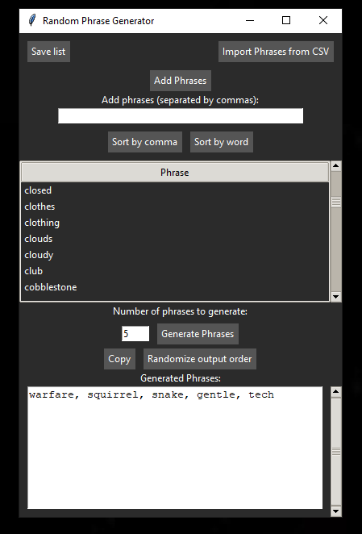

# prompt-randomizer
A standalone prompt randomizer that takes A1111 `styles.csv` files, breaks the prompts up into a table, then lets you generate random prompts from that table.

# If you're just looking for the download, check the releases on the right.
If you want to run it from the script instead, do this.
- Clone repo.
- Go into that directory and run `pip install requirements.txt`
- Start with `python app.py`

# Isn't there already an A111 extension for this...?
Is there....? Idk. I vaguely looked and couldn't find one. So I made a tool for it. I eventually want to make it into an extension.

# But what does it do...?
- Import your `styles.csv` file and it will break it up by commas. 
- Sort by either `comma` or `word`. Both are alphabetical.
- Input a number in the tiny box and click `Generate Phrases`
- Press the `Copy` button to save the output to your clipboard. 
- Press the `Randomize output order` to randomize the phrases in the output box. Just for a bit more variety.
- Add in more phrases in the box at the top. Separate your entries by commas.

# Why?
I've been using Stable Diffusion since around October of last year. My saved prompts file is quite large. Figured it'd be nice to be able to random generate prompts from *prompts I've made*.

# The Jank
Yeah, it doesn't work exactly right sometimes.

I removed the "save list" button for the time being because it's borked. It will save the `phrases.txt` file on import. You can edit that file if you want to remove certain entries.

You can also select items from the table and `right click - delete` them, but it won't save to the `phrases.txt` file. That is also broken. 

There are other things that are broken too. I promise.

If anything catastrophic happens, just delete the `phrases.txt` and reimport.

# Disclaimer
I made this with the help of ChatGPT.

I give it an 80-20 split. Curating the output of ChatGPT (and wrangling its responses) warrants me at least 20% in my eyes.

# Want to fix stuff? 
Please do. I tried to comment almost everything.

Here's some things I want to do eventually:
- Create an extension for A1111 to use it natively
- Fix the removal of entries from the table and save them correctly into the `phrases.txt` file.
- Parentheses are bugged with `Sort by word`. Check that part of the script. You'll see.
- Remove non-useful words during `Sort by word` (such as "a", "an", etc.)
- Have different sorting methods for the table...?
- Figure out how to make `pyinstaller` not make a 34mb exe. Like, the script is only 15KB. What the heck, `pyinstaller`?
- Include a heckin' sweet picture of a cat somewhere that only appears if you click certain buttons in a certain order.
